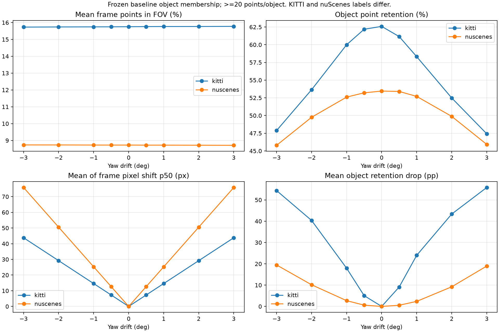
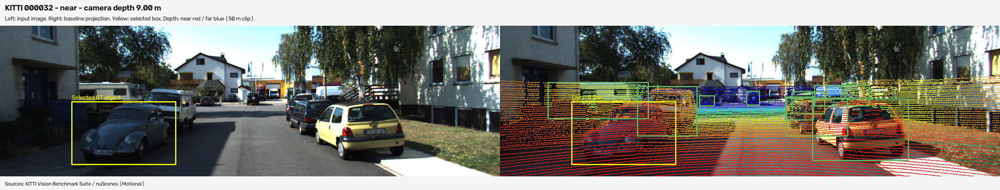
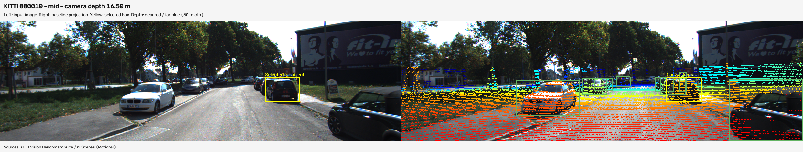
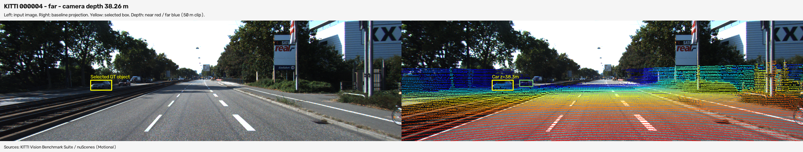
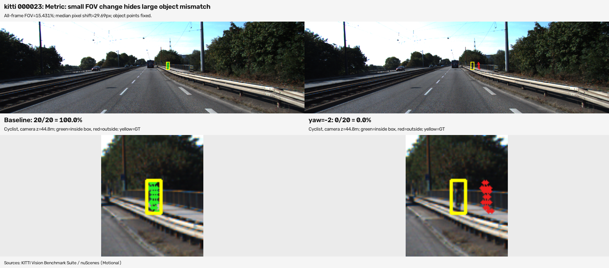
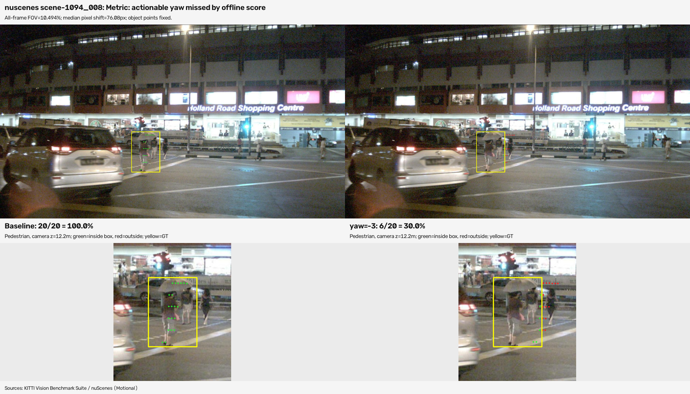

# Báo cáo Day 6: Độ nhạy của LiDAR–camera projection trước calibration drift

- **Họ tên:** Lưu Quang Khải
- **MSSV:** 2A202602599
- **Lớp:** H210
- **Link repo:** https://github.com/luuquangkhai9/LuuQuangKhai-2A202602599-Track4-Day21
- **Topic:** A — LiDAR-camera projection QA
- **Dataset:** data/synthetic (kiểm chứng), data/kitti_mini, data/nuscenes_mini_subset
- **Các frame đã dùng:** KITTI: 000001, 000004, 000007, 000008, 000009, 000010, 000011, 000012, 000015, 000016, 000019, 000021, 000023, 000025, 000031, 000032, 000043, 000048, 000049, 000061. nuScenes: scene-0103_000–039 và scene-1094_000–039. Synthetic: 000000–000004 cho data health, 000000 cho kiểm chứng projection. Cấu hình: [run_config.json](../results/run_config.json).

## 1. Claim

Trên 20 frame KITTI, yaw **+1°** làm retention trung bình theo object giảm từ **91.25% xuống 67.27%** (−23.98 điểm phần trăm, 82 object có ≥20 điểm); trung bình p50 dịch chuyển pixel theo frame là **14.59 px**. Trong khi đó, tỷ lệ trong FOV trung bình chỉ đổi **15.754% → 15.764%**.
Vì vậy, FOV gần như không đổi không đủ để kết luận calibration đúng. Đây là kết quả trên tập dữ liệu đã chọn, không phải bảo đảm cho mọi sensor hoặc scene.

## 2. Evidence

19 cấu hình/frame, tổng **1.900** lần đánh giá trên 100 frame. Mỗi sweep chỉ thay một yếu tố; membership object lấy từ box 3D với calibration gốc và giữ cố định, kể cả điểm bị đẩy ra ngoài ảnh. Không lấy mẫu ngẫu nhiên; seed khai báo 42, không có phép ngẫu nhiên. Chỉ thống kê retention chính cho object ≥20 điểm.

| Dataset / perturb | FOV TB (%) | Retention theo điểm (%) | Retention TB/object (%) | TB p50/frame (px) |
|---|---:|---:|---:|---:|
| KITTI / baseline | 15.754 | 62.59 | 91.25 | 0.00 |
| KITTI / yaw +1° | 15.764 | 58.31 | 67.27 | 14.59 |
| KITTI / yaw +3° | 15.774 | 47.42 | 35.42 | 43.79 |
| KITTI / dịch trái +10 cm | 15.760 | 61.88 | 89.12 | 6.01 |
| nuScenes / baseline | 8.727 | 53.46 | 79.52 | 0.00 |
| nuScenes / yaw +1° | 8.724 | 52.70 | 77.15 | 25.27 |
| nuScenes / yaw +3° | 8.712 | 45.92 | 60.57 | 75.85 |



| Gần: 9.00 m | Trung bình: 16.50 m | Xa: 38.26 m |
|---|---|---|
|  |  |  |

Số liệu đầy đủ: [object CSV](../results/calibration_sweep_objects.csv), [frame CSV](../results/calibration_sweep_frames.csv), [summary CSV](../results/calibration_sweep_summary.csv). Các sweep còn lại: [translation](../results/figures/translation_vs_metrics.png), [pitch](../results/figures/pitch_vs_metrics.png), [roll](../results/figures/roll_vs_metrics.png), [nhóm độ sâu](../results/figures/yaw_by_depth.png).
KITTI có TB **119.318** điểm hữu hạn/frame; nuScenes **34.719**, sensor và ảnh khác nhau (64/32 beam, ảnh khoảng 1242×375/1600×900). Pixel shift còn phụ thuộc focal length, không chỉ độ thưa. nuScenes có ngày/đêm và bù ego motion; box 2D được sinh từ box 3D, nên retention hai dataset không phải cùng một ground truth độc lập.
Retention theo điểm bị chi phối bởi xe gần, nhiều điểm và truncated; retention TB/object cho mỗi object trọng số bằng nhau. Có 82/196 object đủ điểm trên 18/68 frame KITTI/nuScenes; frame không đủ object vẫn có FOV/pixel metric, không bị coi là score bằng 0. nuScenes không có object xa ≥30 m đủ điểm trong các class đã chọn.
Advanced: score offline = retention theo điểm của baseline trừ retention sau drift, đơn vị pp; ngưỡng fit trên tập train riêng (KITTI 2.176 pp; nuScenes 1.145 pp). Với điều kiện cảnh báo |yaw|≥1° và control 0/±0.5°, test TPR/FPR lần lượt **85.19%/33.33%** và **79.17%/25.00%**; chưa phù hợp triển khai trực tiếp. Xem [score plot](../results/figures/alignment_score_threshold.png), [confusion CSV](../results/calibration_sweep_detector.csv), [prediction CSV](../results/calibration_sweep_predictions.csv), [phương pháp và giới hạn](METHODS.md).

## 3. Failure case

**Geometry:** KITTI `000023`, cyclist z=44.76 m, yaw −3° làm điểm thuộc object nằm trong box giảm **20/20 → 0/20**. Calibration sai khiến điểm chiếu lệch khỏi cyclist; cần kiểm tra extrinsic bằng overlay và đối chiếu vật nhỏ/xa.
**Metric (FOV):** cùng frame, yaw −2° cũng làm retention **100% → 0%**, nhưng FOV chỉ giảm **0.00498 pp** (15.43617% → 15.43119%). Đếm điểm trong toàn ảnh không kiểm tra vị trí tương đối với object.
**Metric (score):** nuScenes test `scene-1094_008`, yaw −3°, pedestrian 12.19 m giảm **20/20 → 6/20**. Score toàn frame **1.102 pp < ngưỡng 1.145 pp**, nên bỏ sót drift dù p50 dịch chuyển **76.08 px**. Một xe 72 điểm lại tăng retention 43.06%→83.33%, bù mất mát của người đi bộ; thêm xe 481 điểm chi phối trọng số. Cần score theo object/class và kiểm tra trường hợp cải thiện giả.

| Geometry | FOV bỏ sót | Score bỏ sót trên test |
|---|---|---|
|  |  |  |

Thông tin cấu hình/failure: [failure_selection.json](../results/failure_selection.json). Mẫu 20 điểm có độ phân giải 5 pp/điểm; không suy diễn tỷ lệ này thành recall detector.

## 4. Khuyến nghị nếu triển khai thật

Trong ADAS, dùng QA calibration sau bảo dưỡng hoặc va chạm vào giá đỡ cảm biến; tập trung pedestrian/cyclist và nhiều nhóm độ sâu.
Ghi log invalid ratio, mật độ điểm, timestamp delta, coverage object, alignment theo class và p50/p95 latency. Metric dựa label trong bài chỉ dùng offline, cần metric từ biên ảnh/depth hoặc mốc hình học cho online.
Đánh đổi: lấy nhiều frame/object tăng độ tin cậy nhưng tăng tính toán; giảm điểm có thể bỏ sót vật nhỏ/xa. Chưa đo latency trong bài này, nên chưa kết luận đáp ứng thời gian thực.
Ngưỡng hiện tại còn false alarm/bỏ sót cao; cần label độc lập, thêm scene, bù chuyển động vật thể, kiểm tra nhiều loại drift và xác minh trên dữ liệu ngoài tập fit. Khi coverage thấp, trả trạng thái “không đủ bằng chứng” thay vì “calibration tốt”.

## 5. Cách chạy lại

Từ repo sạch, Python ≥3.10, CPU, không cần GPU. Dùng requirements của đề bài; [versions đã chạy](../results/environment.json) và [requirements tái tạo](../src/requirements-repro.txt) ghi phiên bản cụ thể. Windows có thể thay `python` bằng `.venv\Scripts\python.exe` sau khi tạo venv và cài thư viện.

```powershell
python -m venv .venv
.venv\Scripts\python.exe -m pip install -r src/requirements-repro.txt
.venv\Scripts\python.exe tools/verify_data.py --data-root data/kitti_mini
.venv\Scripts\python.exe tools/verify_data.py --data-root data/nuscenes_mini_subset
.venv\Scripts\python.exe -m src.projection_checks
.venv\Scripts\python.exe -m starter.data_health --data-root data/synthetic
.venv\Scripts\python.exe -m starter.projection --data-root data/synthetic --frame 000000
.venv\Scripts\python.exe -m starter.projection --data-root data/kitti_mini --frame 000011
.venv\Scripts\python.exe -m starter.projection --data-root data/nuscenes_mini_subset --frame scene-0103_010
.venv\Scripts\python.exe -m src.run_calibration_qa --out-dir results/reproduced
.venv\Scripts\python.exe -m src.verify_reproduction --reference results --candidate results/reproduced
.venv\Scripts\python.exe -m src.plot_calibration_qa --results-dir results --stage all
.venv\Scripts\python.exe tools/check_submission.py
```

Runner xuất đủ 5 CSV và cấu hình; verifier so sánh tất cả CSV, danh sách frame/config và invariant mẫu số. `--help` của runner/plot mô tả tham số. Không ghi đè dữ liệu gốc. Sau khi stage file mới, chạy lại check_submission vì phần quét file lớn/secret của script chỉ xét file được Git theo dõi.

## 6. Khai báo sử dụng AI

| Công cụ | Dùng cho việc gì | Cách kiểm chứng / trách nhiệm |
|---|---|---|
| OpenAI Codex | Đọc đề, lập kế hoạch, cài projection/metric/CLI, chạy benchmark, vẽ ảnh, soạn báo cáo và nội dung thuyết trình | Codex chạy điểm chuẩn synthetic, pinhole giải tích, mask NaN/Inf/bounds, box xoay, kiểm mẫu số cố định; kiểm tra trực quan ảnh và tái tạo toàn bộ CSV từ clone sạch. Các số liệu lấy từ code chạy thật; ảnh lấy từ dữ liệu đề bài. Học viên cần tự đọc code, chạy lại và tập giải thích trước khi nộp; không khai báo rằng học viên đã thực hiện việc này. |

Code tự viết đặt trong `src/`; chỉ sửa hai hàm TODO của `starter/projection.py`. Sử dụng loader/overlay/perturb từ code starter do giảng viên cung cấp. Nguồn ảnh: **KITTI Vision Benchmark Suite** và **nuScenes (Motional)**. Nội dung nói 3 phút: [PRESENTATION.md](PRESENTATION.md).
